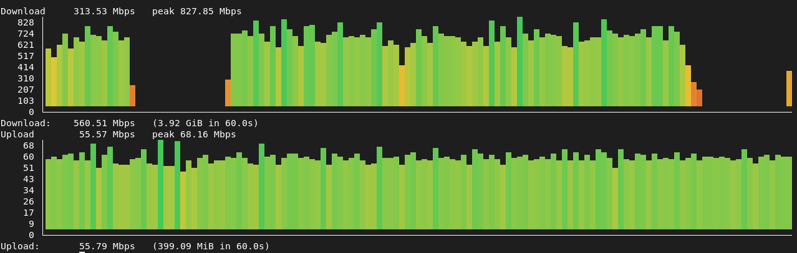

# 10000speedtest

A command-line download/upload speed test for the China Telecom Guangdong
network. It reproduces, on the terminal, the test that the web page at
[`https://10000.gd.cn/#/speed`](https://10000.gd.cn/#/speed) runs in the browser.

> The test servers (`gz.10000gd.tech`) are only reachable from within the China
> Telecom Guangdong network, so the tool must be run from a host on that network.



## How it works

The web client drives its test with many parallel HTTP connections against a
regional server (for example `gz.10000gd.tech:12348`):

| Stage    | Request                                  | Behaviour                                   |
| -------- | ---------------------------------------- | ------------------------------------------- |
| Download | `GET /shmfile/<sizeMiB>?tag=<random>`    | server streams `sizeMiB` MiB of random data |
| Upload   | `POST /upload?tag=<random>`              | client streams a body, server sinks it      |

`tag` is a random cache-buster, and each request opens a fresh connection
(`Connection: close`). `10000speedtest` opens `--connections` of these in
parallel for `--duration`, sums the bytes moved, and reports the throughput in
Mbps with a live readout.

The test server negotiates TLS 1.2 with the RSA cipher `AES256-GCM-SHA384`,
which Go does not offer by default; the client enables it explicitly so the
handshake succeeds.

## Install

```sh
go install github.com/ziyan/10000speedtest@latest
```

Or download a prebuilt binary from the [releases](https://github.com/ziyan/10000speedtest/releases) page, or build from source:

```sh
make build
```

## Usage

```sh
# Run both stages with defaults (8 connections, 10s each)
10000speedtest

# Download only, 16 connections, 15 seconds
10000speedtest --mode download --connections 16 --duration 15s

# Point at a different regional server
10000speedtest --server https://gz.10000gd.tech:12348
```

On a terminal, each stage draws a live, colored bar chart of throughput over
time (bars shaded red → yellow → green by height), then prints the average. The
first second of each stage — the connection-ramp warmup — is left out of the
chart so the opening spike does not compress the steady state:

```
Download     590.87 Mbps   peak 853.02 Mbps
   853 │               ▂     ▃█
   746 │ ▃▁▇  ▃ ▃▂ ▅▃ ▁█  ▁  ██
   640 │ ███ ▅█ ██▅██▄██▁ █▂▄██▄
   533 │▂███▅██▃█████████▂██████
   427 │████████████████████████
   320 │████████████████████████
   213 │████████████████████████
   107 │████████████████████████
     0 └────────────────────────
Download:    635.04 Mbps   (455.55 MiB in 6.0s)
```

The chart sizes itself to the terminal width. When the output is piped or
redirected (not a terminal), the tool skips the live chart and progress
rewriting entirely and prints just the header and final per-stage summary:

```
Download:    671.64 Mbps   (640.83 MiB in 10.0s)
Upload:       65.30 Mbps   (62.28 MiB in 10.0s)
```

Pass `--chart=false` for the same plain output on a terminal.

Use `--json` for machine-readable results only (no header or live progress):

```sh
10000speedtest --json --duration 5s
```

```json
{
  "server": "https://gz.10000gd.tech:12348",
  "connections": 8,
  "durationSeconds": 5,
  "download": { "mbps": 672.93, "bytes": 422739968, "seconds": 5.03 },
  "upload": { "mbps": 68.50, "bytes": 42827776, "seconds": 5.00 }
}
```

## Flags

| Flag              | Default                          | Description                                        |
| ----------------- | -------------------------------- | -------------------------------------------------- |
| `--server`        | `https://gz.10000gd.tech:12348`  | base URL of the speed-test server                  |
| `--mode`          | `both`                           | which test to run: `download`, `upload`, or `both` |
| `--connections`   | `8`                              | number of parallel connections                     |
| `--duration`      | `10s`                            | duration of each test stage                        |
| `--download-size` | `20`                             | MiB requested per download connection              |
| `--upload-size`   | `20`                             | MiB posted per upload connection                   |
| `--insecure`      | `true`                           | skip TLS certificate verification                  |
| `--chart`         | `true`                           | live colored bar chart (auto-off when not a TTY)   |
| `--json`          | `false`                          | print only the final results as JSON               |
| `--log-level`     | `info`                           | log level (`debug`, `info`, `notice`, …)           |

Set `NO_COLOR` in the environment to draw the chart without ANSI colors.

## Exit status

The exit code reflects whether the test succeeded:

- `0` — every requested stage transferred data.
- non-zero — a stage that ran moved no data (the server was unreachable or every
  request failed); the failing stage is named on stderr. In `--json` mode the
  JSON is still written to stdout before the process exits non-zero.

This makes the tool safe to use in scripts:

```sh
if 10000speedtest --json --duration 5s > result.json; then
  echo "ok"
else
  echo "speed test failed" >&2
fi
```

## Contributing

See [CONTRIBUTING.md](CONTRIBUTING.md) for development setup, code conventions,
and how to cut a release.

## License

[MIT](LICENSE)
